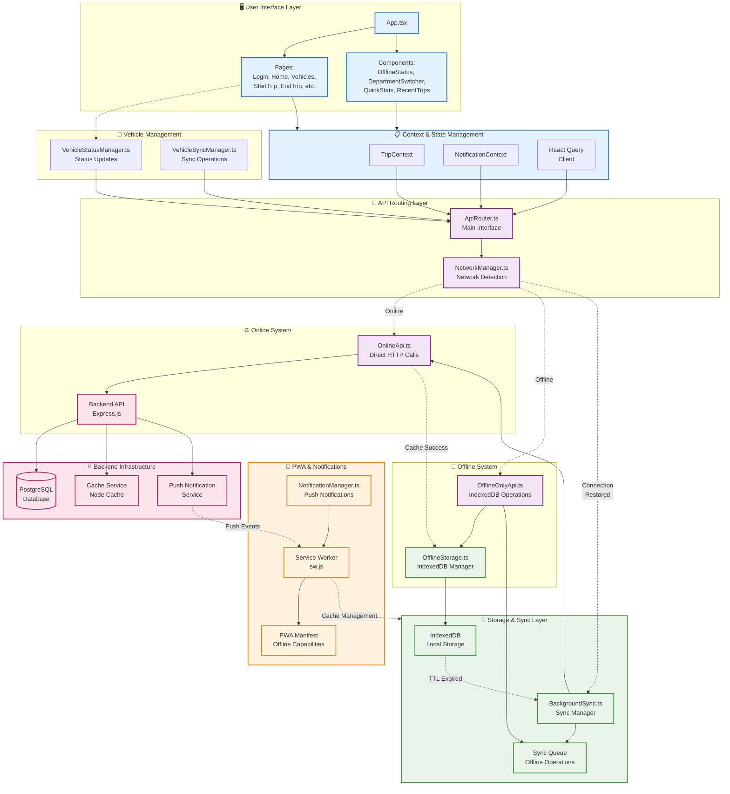

# 🏗️ Overall System Architecture

This flowchart shows the complete communication flow between all components in the Fleet Tracker PWA.

## 🔄 Communication Flow

### 1. **User Interface Layer**
- **React Components** handle user interactions
- **Pages** manage routing and page-specific logic  
- **Components** provide reusable UI elements

### 2. **Context & State Management**
- **TripContext** manages trip state across components
- **NotificationContext** handles notification logic
- **React Query** provides server state management

### 3. **API Routing Layer**
- **ApiRouter** is the single interface for all API calls
- **NetworkManager** detects online/offline status
- Automatically routes to appropriate API system

### 4. **Dual API Systems**
- **Online System**: Direct HTTP calls to backend
- **Offline System**: Pure IndexedDB operations
- Complete independence between systems

### 5. **Storage & Sync**
- **IndexedDB** stores all offline data
- **BackgroundSync** handles sync when connection returns
- **Sync Queue** manages failed operations

### 6. **Vehicle Management**
- **VehicleStatusManager** handles real-time status updates
- **VehicleSyncManager** manages vehicle data synchronization

### 7. **PWA & Notifications**
- **Service Worker** enables offline functionality
- **NotificationManager** handles push notifications
- **PWA Manifest** provides app-like experience

### 8. **Backend Infrastructure**
- **PostgreSQL** database for persistent storage
- **Cache Service** improves performance with node-cache
- **Push Service** handles notification delivery 