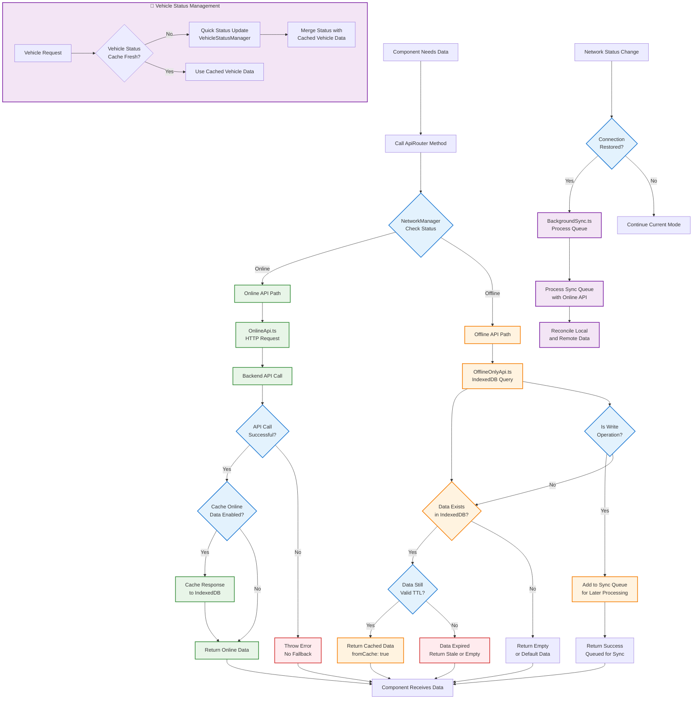

# 🔀 API Routing System

This flowchart shows how the ApiRouter automatically switches between online and offline systems based on network status.



## 🔄 API Router Flow Details

### 1. **Network Detection**
- **Continuous Monitoring**: NetworkManager runs periodic connectivity tests
- **Multiple Checks**: Tests browser navigator.onLine + actual backend ping
- **Event Driven**: Components subscribe to network status changes

### 2. **Online Mode Operations**
```typescript
// ApiRouter automatically routes to OnlineApi
const result = await apiRouter.getVehicles();
// → OnlineApi.getVehicles() → HTTP call to backend
// → Optional caching for offline use
```

### 3. **Offline Mode Operations**
```typescript
// Same interface, different implementation
const result = await apiRouter.getVehicles();
// → OfflineOnlyApi.getVehicles() → IndexedDB query
// → Write operations queued for sync
```

### 4. **Background Sync Process**
- **Trigger Events**: Network reconnection, app visibility, manual trigger
- **Priority Queue**: High priority (trips) → Medium → Low priority operations
- **Retry Logic**: Exponential backoff for failed sync attempts
- **Conflict Resolution**: Server data takes precedence, local data reconciled

### 5. **Cache Management**
- **TTL System**: Different cache lifetimes per data type
- **Smart Invalidation**: Related cache cleared on data changes
- **Storage Monitoring**: Track IndexedDB usage and cleanup expired data

### 6. **Vehicle Status Optimization**
- **Separate TTL**: Vehicle status cached for 5 minutes vs 30 minutes for data
- **Quick Updates**: Lightweight status-only refreshes when needed
- **Batch Operations**: Multiple vehicle status updates in single call

## 🎯 Key Benefits

1. **🔄 Seamless Switching**: Components use same interface regardless of network status
2. **⚡ Performance**: Cached data serves instantly, online data cached for offline use
3. **🛡️ Independence**: Offline system failures don't impact online functionality
4. **🔄 Auto-Sync**: Offline operations automatically sync when connection returns
5. **📊 Transparency**: Components know if data is from cache or network 